# Auto-RepoFlow: ภาพรวมและ Flow การทำงาน

เอกสารนี้อธิบายระบบ Auto-RepoFlow ตั้งแต่รับ repository จนถึงการสร้างรายงาน
โดยเน้น privacy, evidence traceability และ human review เป็นหลัก

> ขอบเขตปัจจุบัน: `EvaluationRun` หยุดที่ `REPORT_READY` ส่วน `ChangeRun` v0.3
> รองรับเฉพาะ test gap บน JavaScript/TypeScript ใน isolated worktree และหยุดที่
> `VERIFIED_LOCAL_PATCH` ระบบไม่ invoke agent, push, สร้าง PR, merge, deploy หรือ
> publish

## 1. Mental model

Auto-RepoFlow คือ local-first engineering evidence auditor ที่ตอบคำถามว่า:

1. ทีมตั้งใจสร้างอะไรจาก design และ specification?
2. Repository มี implementation อะไรจริง?
3. มี test และ quality evidence รองรับหรือไม่?
4. Artifact ส่วนใดขาดหรือขัดแย้งกัน?
5. ข้อสรุปแต่ละข้ออ้างอิงจากหลักฐานใด?

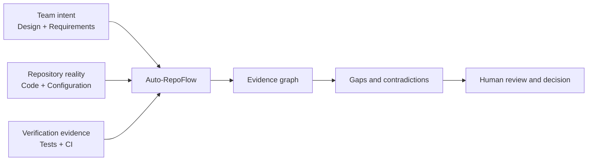

## 2. System context

Auto-RepoFlow เป็น platform แยกจาก repository ที่ถูกตรวจ หนึ่ง platform จึงรับได้หลาย
repositories ผ่าน `sourcePath` และ private configuration ของแต่ละ evaluation

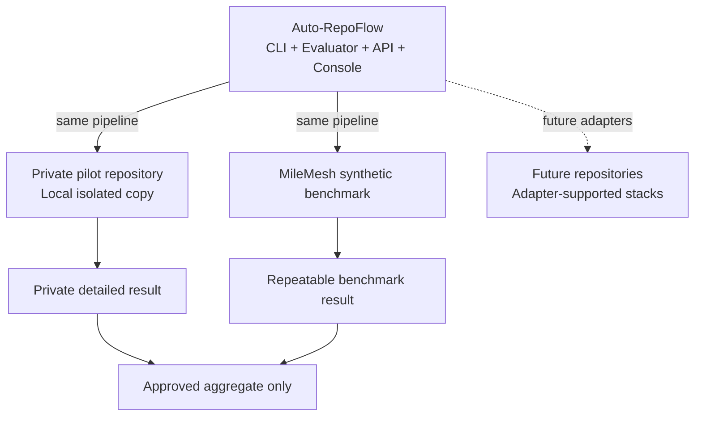

## 3. Main components

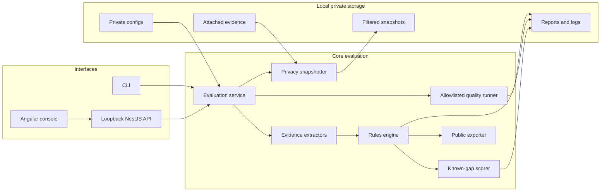

## 4. End-to-end EvaluationRun

ผู้ใช้เรียก pipeline หนึ่งคำสั่ง ระบบจะทำงานตามลำดับต่อไปนี้

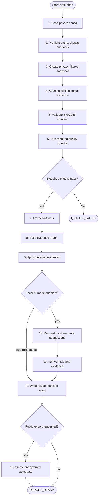

## 5. Pipeline sequence

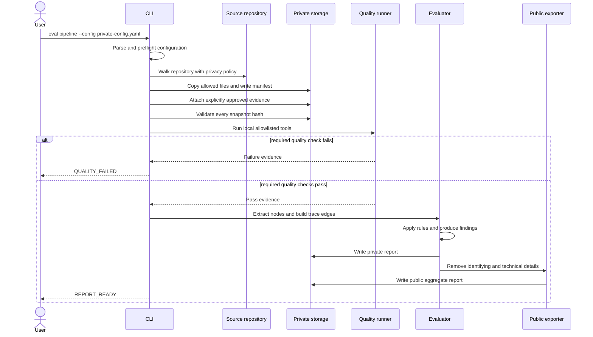

## 6. Private configuration and preflight

Private config ระบุ repository, scope, mode, evidence และ quality gates โดยไม่ต้อง
hard-code project ใดลงใน platform

```yaml
schemaVersion: 1
sourcePath: /absolute/path/to/repository
projectName: Local-Evaluation
mode: rules
scopePrefix: /api
evidence: []
quality:
  timeoutSeconds: 300
  checks:
    - id: typecheck
      tool: tsc
      args: [--noEmit]
    - id: tests
      tool: vitest
      args: [run]
exportPublic: true
```

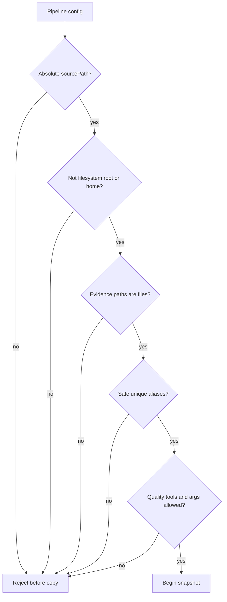

## 7. Privacy boundary

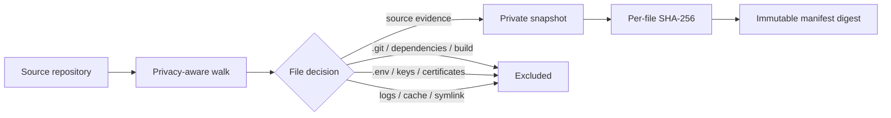

Default exclusions ได้แก่:

- `.git`
- `.env*`
- private keys และ certificates
- `node_modules`, `dist`, `build`, `coverage`
- caches, logs, worktrees, mirrors และ prior artifacts
- symbolic links

Private root ใช้ permission `0700` และ manifests/reports ใช้ `0600`
manifest เก็บ relative paths และ hashes แต่ไม่เก็บ absolute source root

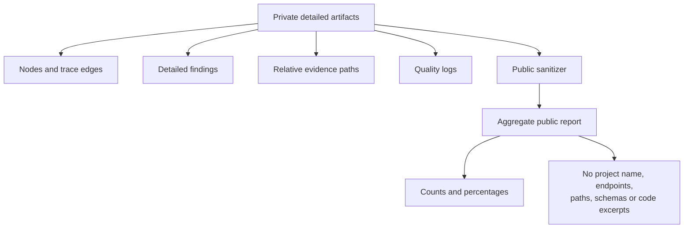

Git remote, AI provider และ public export เป็นสาม permissions แยกจากกัน
การอนุญาตอย่างหนึ่งไม่ถือว่าอนุญาตอีกอย่างหนึ่ง

## 8. Quality execution boundary

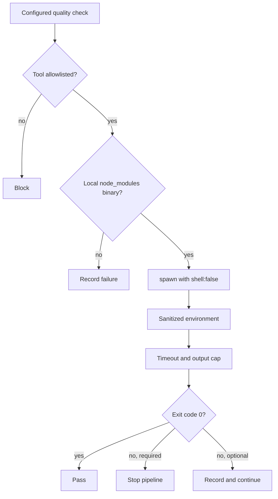

Allowed tools ปัจจุบันคือ `tsc`, `jest`, `vitest`, `eslint` และ `tslint`
ระบบไม่รับ arbitrary package script หรือ arbitrary executable จาก config

ข้อจำกัด: process มี sanitized environment และไม่ใช้ shell แต่ยังไม่มี OS-level
network sandbox ดังนั้น repository test code ต้องเป็น code ที่ทีมเชื่อถือได้

## 9. Evidence extraction

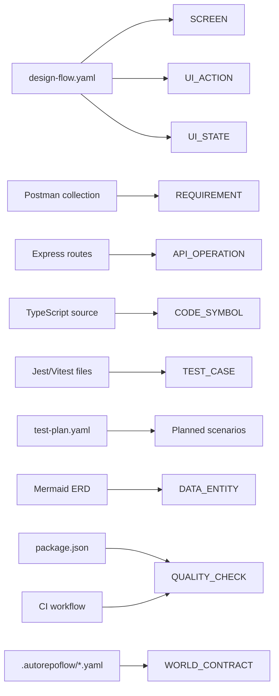

แต่ละ node มี stable ID และ evidence reference เช่น relative path, line และ SHA-256
จึงสามารถตรวจย้อนกลับได้ว่าข้อสรุปมาจาก snapshot file ใด

## 10. Evidence graph

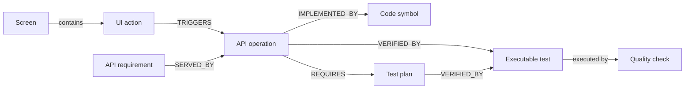

Trace edge ระบุชนิดความสัมพันธ์, source, confidence, rationale และ review status
ความสัมพันธ์ exact method/path ให้ confidence สูง ส่วน inferred semantic link ต้องผ่าน
human review หาก confidence ไม่พอ

## 11. Deterministic rules and findings

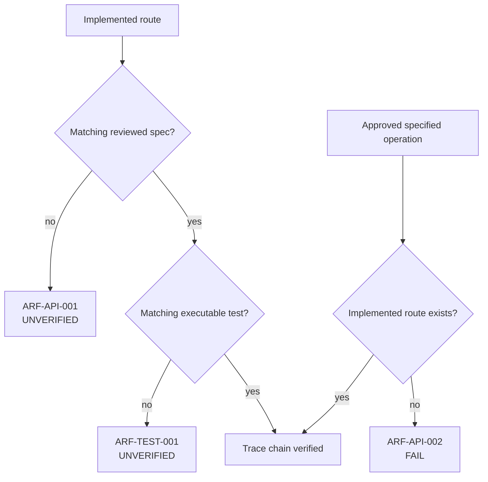

สถานะหลัก:

| Status | ความหมาย |
| --- | --- |
| `PASS` | มี evidence chain ที่ rule ยืนยันได้ |
| `FAIL` | พบ contradiction ที่ชัดเจน |
| `UNVERIFIED` | หลักฐานยังไม่พอยืนยัน |
| `HUMAN_REVIEW_REQUIRED` | มี candidate link หรือ draft evidence ที่คนต้องอนุมัติ |

ตัวอย่าง rules เพิ่มเติม:

- UI action ไม่เชื่อมกับ API
- response-to-screen mapping ไม่มี fields
- confirmation หรือ permission state หาย
- acceptance criteria หาย
- reviewed test scenario ไม่มี executable test
- root build/test command หาย
- static analysis evidence หาย
- CI ไม่มี API contract check

## 12. Coverage model

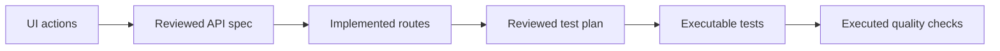

ระบบรายงาน metrics แยกกันเพื่อไม่ให้ build success กลบ traceability gaps:

- `ui-api`: UI actions ที่เชื่อมกับ API
- `api-spec`: routes ที่มี reviewed API specification
- `api-spec-readiness`: routes ที่มี reviewed หรือ draft specification
- `implementation`: routes ที่เชื่อมกับ implementation
- `test-plan`: routes ที่มี test plan
- `test`: routes ที่มี executable tests
- `test-scenario`: current-scope reviewed scenarios ที่มี executable tests
- `test-scenario-roadmap`: full-roadmap scenarios ที่มี executable tests

## 13. Known-gap benchmark scoring

MileMesh มี synthetic answer key ที่กำหนดก่อนประเมิน เพื่อวัดความแม่นยำของ
evaluator โดยไม่ใช้ข้อมูลบริษัท

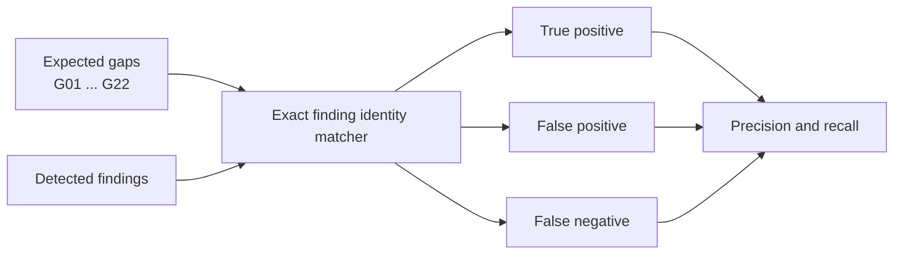

```text
Precision = TP / (TP + FP)
Recall    = TP / (TP + FN)
```

Ledger schema v1 ใช้ rule-count matching เพื่อ backward compatibility
ledger schema v2 ใช้ exact stable `findingId` และรายงาน:

- `matchedGapIds`
- `missedGapIds`
- `unexpectedFindingIds`

ถ้าระบบพบ rule ถูกประเภทแต่ผิด subject ใน schema v2 จะเกิดทั้ง false positive
และ false negative จึงไม่สามารถได้คะแนน 100% จากการนับจำนวนแบบหลวม ๆ

## 14. AI boundary

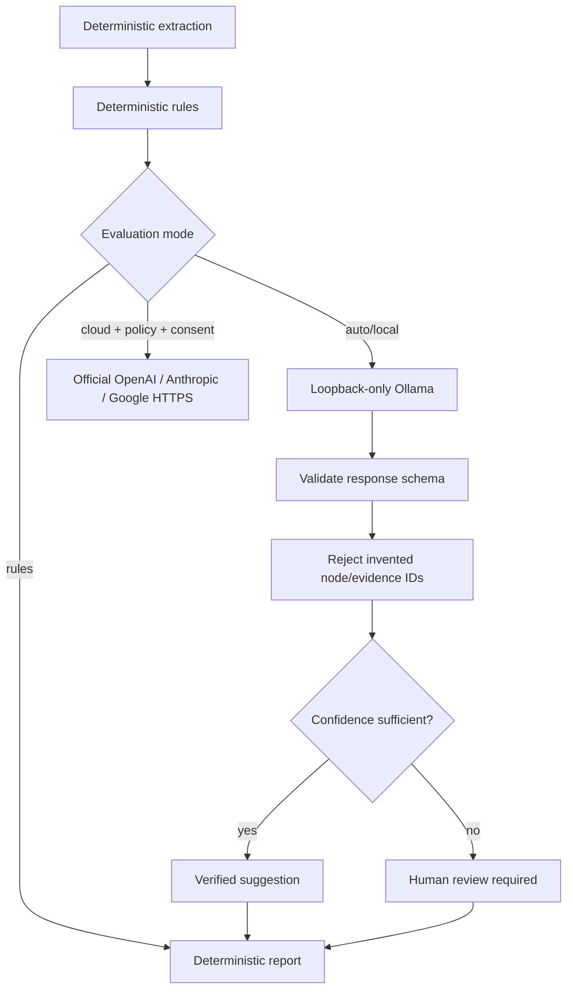

Rules mode ใช้สำหรับ reproducible benchmark และไม่ต้องเรียก generative AI
Local-AI mode ใช้เสนอ semantic links เมื่อ artifact ตั้งชื่อไม่เหมือนกัน แต่ AI:

- เปลี่ยน deterministic failure เป็น pass ไม่ได้
- อ้าง node หรือ evidence ที่ไม่มีจริงไม่ได้
- merge หรือ deploy ไม่ได้
- ต้องผ่าน verification และ human review ตาม confidence

## 15. World Contracts and project identity

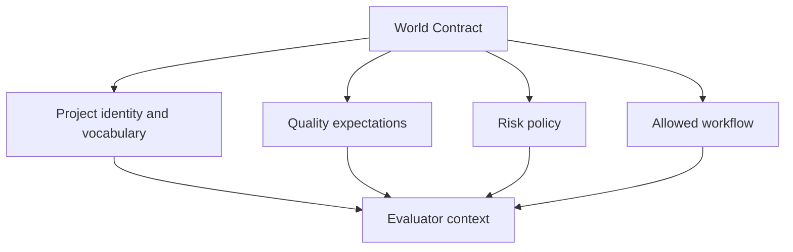

`.autorepoflow/` ทำหน้าที่เป็น project constitution เพื่อรักษา flow, policy และ
identity ของ repository ไม่ให้ automation มอง project เป็นเพียงกอง source files

POC ปัจจุบัน validate และ extract World Contracts เป็น evidence แล้ว การนำ contract
ไปบังคับใช้กับทุกขั้นของ ChangeRun ยังเป็นงานพัฒนาถัดไป

## 16. Authority and terminal states

### EvaluationRun — implemented

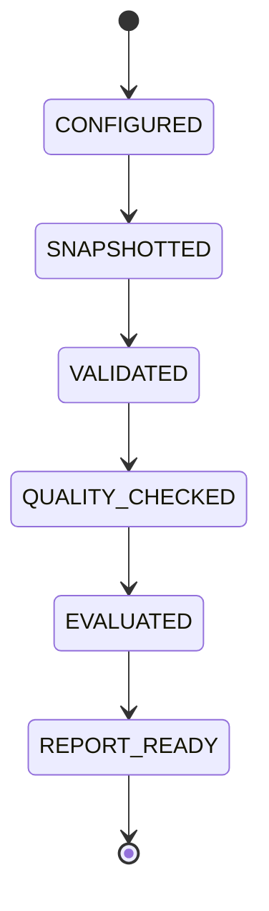

### ChangeRun v0.3 — implemented local test-patch workflow

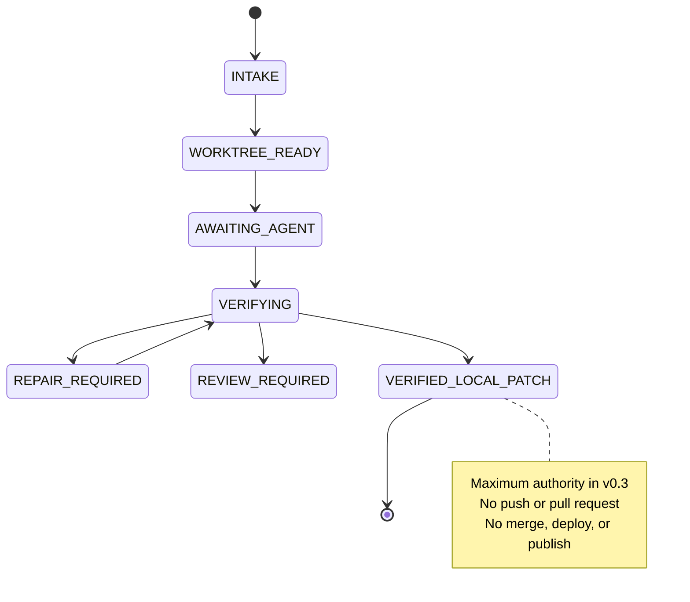

ChangeRun v0.3 รองรับเฉพาะ `ARF-TEST-001` และไฟล์ทดสอบ JavaScript/TypeScript
ใน isolated worktree ผู้ใช้เป็นผู้เปิด IDE agent เอง ส่วน AutoRepoFlow ทำหน้าที่
ตรวจ test-only patch, รัน exact checks ที่ policy อนุญาต, rescan และหยุดที่
`VERIFIED_LOCAL_PATCH` เท่านั้น

## 17. MileMesh Cycle 2 example

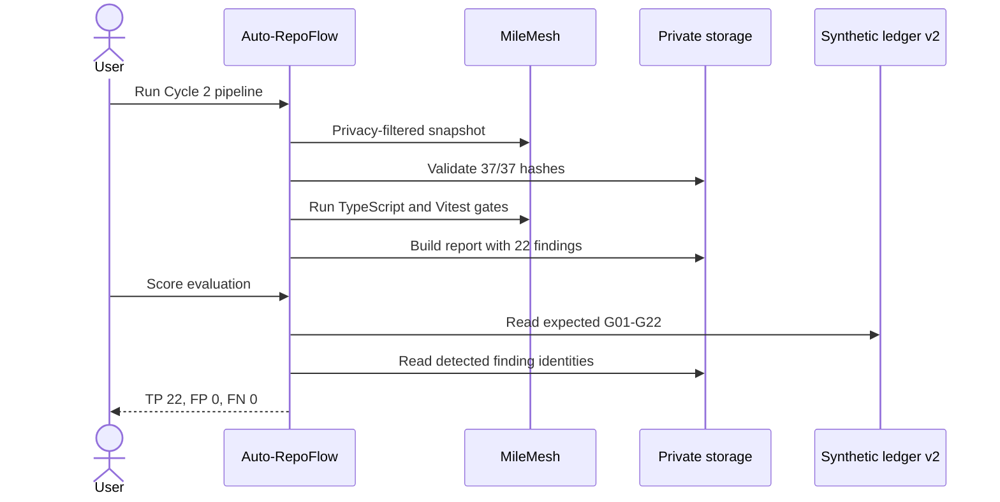

ผลที่ยืนยันแล้วบน synthetic benchmark:

| Metric | Result |
| --- | ---: |
| Included snapshot files | 37 |
| Manifest validation | 37/37 |
| Required quality gates | Passed |
| Implementation linkage | 11/11 — 100% |
| Reviewed API-spec coverage | 9/11 — 81.8% |
| Executable-test linkage | 1/11 — 9.1% |
| UI-to-API linkage | 10/10 — 100% |
| Exact known gaps | 22/22 |
| False positives | 0 |
| False negatives | 0 |
| Exact-match precision | 100% |
| Exact-match recall | 100% |

ตัวเลขนี้เป็นผลของ MileMesh synthetic benchmark ไม่ใช่ข้ออ้างว่า framework และ
repository ทุกชนิดจะได้ 100% เหมือนกัน

## 18. Current capabilities and limits

### ใช้งานได้แล้ว

- config-driven local evaluation
- privacy-filtered snapshot และ SHA-256 manifest
- explicit evidence attachment
- manifest tamper validation
- allowlisted TypeScript/Jest/Vitest quality execution
- design-flow, Postman, Express, TypeScript, test, CI, ERD และ World extraction
- deterministic findings และ coverage
- exact known-gap scoring schema v2
- private detailed report และ anonymized public report
- loopback-only Ollama และ explicit metadata-only cloud provider boundary

### ข้อจำกัดปัจจุบัน

- static PNG/Figma ต้องผ่าน human-reviewed design-flow mapping
- extractor เน้น TypeScript/Express; framework อื่นต้องมี adapters
- route registration ยังไม่พิสูจน์ controller-service-repository chain ทั้งหมด
- field-level request/response/schema tracing ยังไม่ลึกพอ
- quality runner ยังไม่มี OS-level network sandbox
- local AI quality/latency ต้องประเมินเมื่อใช้ model จริง
- ChangeRun และ draft-PR workflow ยังไม่ครบเท่า EvaluationRun
- private-pilot time saving ต้องวัดกับผู้ใช้จริงก่อนรายงานเป็นเปอร์เซ็นต์

## 19. Safe demo flow

```mermaid
flowchart LR
    PAIN["Explain review pain"] --> SYNTHETIC["Show synthetic MileMesh"]
    SYNTHETIC --> RUN["Run one-command pipeline"]
    RUN --> COVERAGE["Explain coverage vs quality"]
    COVERAGE --> FINDINGS["Show evidence-backed findings"]
    FINDINGS --> SCORE["Show exact precision/recall"]
    SCORE --> PRIVACY["Show anonymized public report"]
    PRIVACY --> FEEDBACK["Collect team feedback"]
```

สำหรับการบันทึกภาพหรือ poster ให้ใช้ MileMesh และ public aggregate report เท่านั้น
อย่าเปิด private backend, private detailed report หรือ absolute user paths ในภาพ

## 20. One-sentence summary

> Auto-RepoFlow เชื่อมความตั้งใจจาก design และ specification กับสิ่งที่มีจริงใน
> repository แล้วแสดงช่องว่างพร้อมหลักฐาน เพื่อให้ทีม review ได้เร็ว เป็นระบบ และ
> ปลอดภัยขึ้น โดยการตัดสินใจสุดท้ายยังเป็นของมนุษย์
